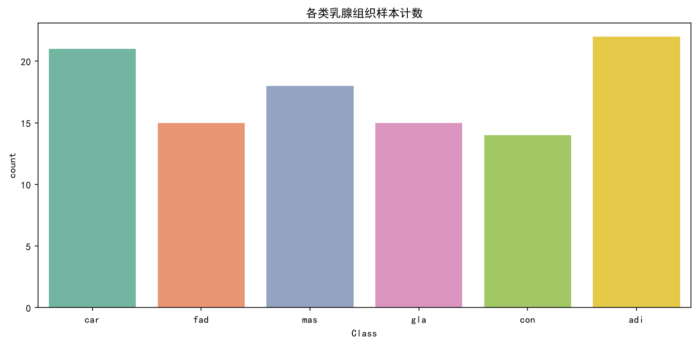
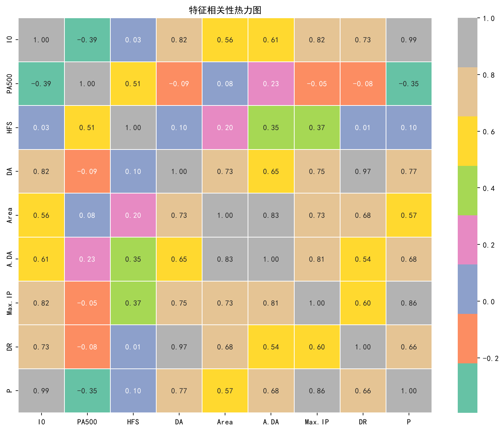
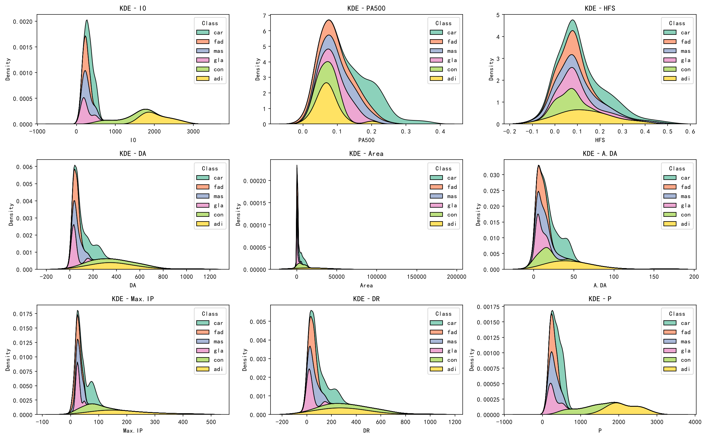
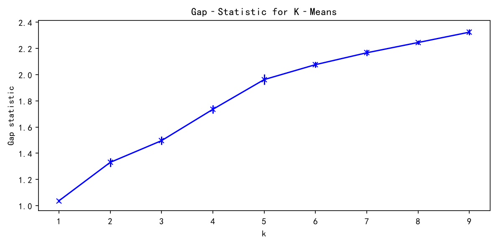
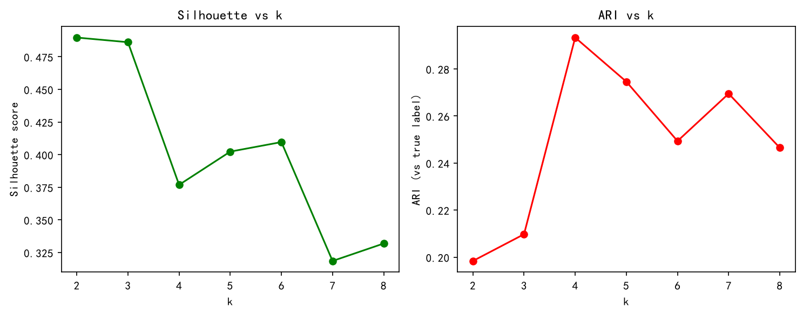
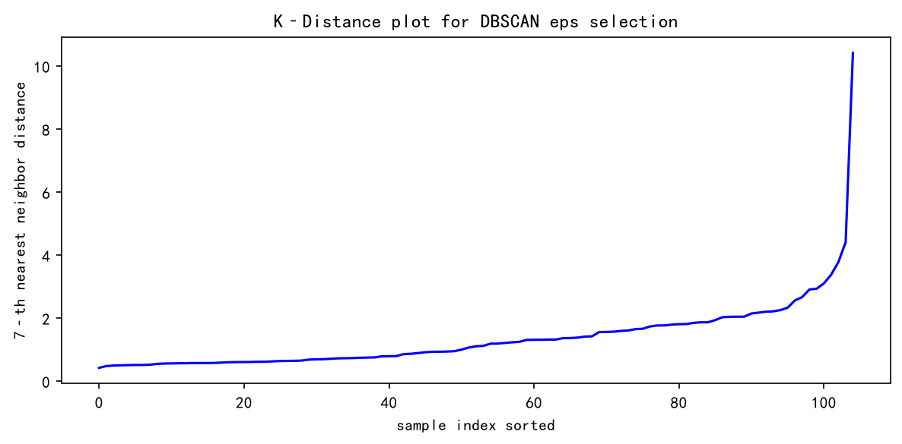
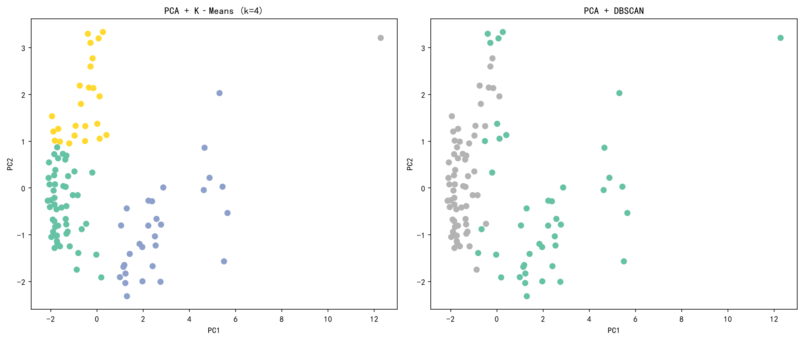

# Clustering under Small Samples — 小样本条件下的聚类有效性分析

## At a Glance

| 关键事实 | 数值 |
| --- | --- |
| 样本规模 | 106 条 |
| 特征 / 类别 | 9 个数值阻抗特征 / 6 类组织 |
| 对比算法 | K-Means、Agglomerative（层次）、DBSCAN |
| 聚类最优 ARI | **0.32**（层次聚类，k=4） |
| 有监督基线 | **0.71**（RBF-SVC 重复交叉验证） |

**结论**：在 n≈100、类间高度重叠的数据上，无监督聚类无法可靠还原真实标签（所有 ARI < 0.35）；内部指标（轮廓系数）与外部指标（ARI）会给出相反的 K 建议，小样本下选 K 必须结合真实标签或业务先验。

---

## 1. 项目简介 / Project Introduction

### 中文

本项目围绕**小样本条件下的无监督聚类有效性**展开研究，使用**乳腺组织电阻抗数据集**（原始 106 个样本、6 类、9 个数值阻抗特征；去重后 105 个样本），系统考察在小样本、类间界限模糊的场景下，不同聚类方法能否有效还原真实类别结构。
项目用于回答一个核心问题：*当数据规模很小（n≈100）且真实标签存在高度混淆时，无监督聚类在多大程度上可信？* 完整分析流水线包括：

- **数据预处理与探索性分析（EDA）**：去重、标签编码、类别计数、特征相关性热力图、各特征 KDE 分布；
- **聚类个数 K 的选择**：Gap Statistic 与 Silhouette / ARI 曲线相结合，辅助确定 K-Means 的簇数；
- **监督基线（参照系）**：RBF 核 SVC 网格搜索，作为“该分类问题能达到何种精度”的参照上限；
- **特征降维对比**：在固定 SVC 参数下，对比 PCA-2、PCA-5 与全特征三种配置的交叉验证精度，评估降维的信息损失；
- **多聚类算法横向对比**：K-Means、层次聚类（Agglomerative）与 DBSCAN 在同一数据上对比，并用轮廓系数（Silhouette）、Davies-Bouldin 指数（DBI）、调整兰德指数（ARI）、调整互信息（AMI）多维评估。

最终结论：**所有聚类方法的 ARI 均低于 0.35，无监督聚类难以可靠还原真实的 6 类乳腺组织标签**；层次聚类表现相对最好，DBSCAN 因数据密度结构重叠严重而明显失效。这为“小样本场景下谨慎使用聚类、优先考虑有监督或半监督方法”提供了量化证据。

### English

This project investigates the **effectiveness of unsupervised clustering under small-sample conditions**. It uses the **Breast Tissue dataset** from the **UCI Machine Learning Repository** (106 samples originally, **105 after deduplication**; 6 classes, 9 numerical impedance features) to examine whether different clustering algorithms can recover the true class structure when the sample size is tiny and class boundaries are highly overlapping.

The core question: *How trustworthy is unsupervised clustering when the sample size is small (n≈100) and the true labels are heavily confounded?* The pipeline includes:

- **Preprocessing & EDA**: deduplication, label encoding, class counts, feature correlation heatmap, and KDE distributions;
- **Choosing K**: Gap Statistic combined with Silhouette / ARI curves;
- **Supervised baseline**: RBF-kernel SVC grid search as a reference for achievable classification accuracy;
- **Dimensionality-reduction comparison**: cross-validated accuracy of PCA-2, PCA-5 and full-feature settings with fixed SVC hyperparameters;
- **Multi-algorithm comparison**: K-Means, Agglomerative clustering and DBSCAN evaluated with Silhouette, Davies-Bouldin index (DBI), Adjusted Rand Index (ARI) and Adjusted Mutual Information (AMI).

Main finding: **all clustering methods achieve ARI below 0.35**, so unsupervised clustering cannot reliably recover the true 6-class labels. Agglomerative clustering performs best, while DBSCAN fails because the density structure overlaps heavily. This supports using clustering with caution on small samples and preferring supervised / semi-supervised methods.

---

## 2. 数据集来源与说明 / Dataset

- **引用**：S, J. & Jossinet, J. (1996). Breast Tissue [Dataset]. UCI Machine Learning Repository. https://doi.org/10.24432/C5P31H.
- **数据集名称**：乳腺组织数据集（Breast Tissue）。
- **许可说明**：数据集版权归原作者所有，本仓库仅用于学习研究。
- 该数据集包含**乳腺新鲜切除组织样本的多频率电阻抗测量数据**。

### 数据集特征（结合本仓库 `data.csv` 实测）

| 项目 | 说明 |
| --- | --- |
| 类型 | 多变量（Multivariate） |
| 学科领域 | 医学 |
| 相关任务 | 分类 / 聚类 |
| 特征类型 | 实数（Real） |
| 实例数 | 原始 106；**去重后 105**（存在一对完全相同的 gla 样本） |
| 特征数 | 10（1 个类别标签 + 9 个数值阻抗特征） |
| 缺失值 | 0 |
| 类别数 | 6（`adi/car/mas/gla/fad/con`） |
| 特点 | 多频率阻抗测量 |

> 说明： 原始文件（`BreastTissue.xls`）含一列顺序编号 `Case #`，本仓库的 `data.csv` **已剔除该编号列**，避免其被误当作数值特征参与标准化与 PCA。

### 采集信息

阻抗在以下频率下测量：**15.625、31.25、62.5、125、250、500 与 1000 KHz**。这些测量值在（实数、虚数）平面绘制时，构成可计算乳腺组织特征的**阻抗谱**。数据集既支持原始 **6 类**分类，也支持按官方建议合并难以区分的 **fad（纤维腺瘤）、mas（乳腺病）、gla（腺体）** 为 **4 类**分类。

### 特征说明（Features）

| 特征 | 含义 | 实测范围（min–max） |
| --- | --- | --- |
| I0 | 零频率时的阻抗率（欧姆） | 103.00 – 2800.00 |
| PA500 | 500 KHz 下的相位角 | 0.01 – 0.36 |
| HFS | 相角高频斜率 | -0.07 – 0.47 |
| DA | 频谱端点之间的阻抗距离 | 19.65 – 1063.44 |
| Area | 频谱面积 | 70.43 – 174480.48 |
| A/DA（data.csv 中为 A.DA） | 由 DA 归一化的面积 | 1.60 – 164.07 |
| Max IP（data.csv 中为 Max.IP） | 频谱的最大值 | 7.97 – 436.10 |
| DR | I0 与最大频率点实部之间的距离 | -9.26 – 977.55 |
| P | 谱曲线长度 | 124.98 – 2896.58 |
| Class | 组织类型（目标变量） | 6 个类别 |

> 注：特征量纲差异极大（如 `Area` 最大约 17 万，而 `PA500` 不到 1），**必须先标准化**再用于 PCA / 聚类。

### 类别说明（Classes）——原始 106 条中的分布

| 标签 | 组织类型 | 中文 | 样本数（原始） | 去重后 |
| --- | --- | --- | --- | --- |
| adi | Adipose | 脂肪 | 22 | 22 |
| car | Carcinoma | 癌 | 21 | 21 |
| mas | Mastopathy | 乳腺病 | 18 | 18 |
| gla | Glandular | 腺体 | 16 | **15** |
| fad | Fibroadenoma | 纤维腺瘤 | 15 | 15 |
| con | Connective | 结缔组织 | 14 | 14 |
| **合计** | | | **106** | **105** |

### 用途与边界

该数据集适合分类 / 聚类任务：阻抗测量可用于预测乳腺组织类型。但**样本量仅百条级、各类别特征高度重叠**，无监督聚类难以可靠还原真实类别（详见第 5 节，所有 ARI < 0.35）。

---

## 3. 如何运行 / How to Run

### 环境要求

- Python 3.8+
- 依赖见 `requirements.txt`

### 步骤

```bash
# 1. 安装依赖
pip install -r requirements.txt

# 2. 运行主脚本（确保 data.csv 与脚本位于同一目录）
python breast_tissue_analysis.py
```

> **Windows 用户提示**：脚本已做适配，网格搜索等环节将 `n_jobs` 设为 1，避免 `loky` 子进程崩溃。

### 运行产出

图表输出到 `figures/`，结果表格输出到 `tables/`。

| 文件 | 说明 |
| --- | --- |
| `figures/eda_class_count.png` | 各类样本计数 |
| `figures/eda_corr_heatmap.png` | 特征相关性热力图 |
| `figures/eda_kde_all_features.png` | 9 个数值特征 KDE 分布 |
| `figures/gap_stat.png` | Gap Statistic 选 K 曲线 |
| `figures/k_metric_curve.png` | Silhouette / ARI vs K 曲线 |
| `figures/k_distance.png` | DBSCAN k-distance 图（选 eps） |
| `figures/cluster_kmeans_dbscan_compare.png` | K-Means 与 DBSCAN 二维 PCA 投影对比 |
| `tables/k_metrics.csv` | 不同 K 下的 Silhouette 与 ARI |
| `tables/dimension_compare.csv` | PCA 维度对比（mean±std） |
| `tables/cluster_compare.csv` | 三种聚类算法指标对比（含双口径） |

---

## 4. 图表说明 / Figure Descriptions

### 4.1 `eda_class_count.png` — 各类样本计数
柱状图展示 6 个类别（car / fad / mas / gla / con / adi）的样本数量。各类约在 14–22 之间（adi≈22 最高，con≈14 最低），**整体相对均衡、无极端类别不平衡**；但总量仅百条级，是典型小样本场景。

### 4.2 `eda_corr_heatmap.png` — 特征相关性热力图
9 个数值特征两两间的皮尔逊相关系数矩阵。可以看到 **I0 与 P 高度相关（r≈0.99）**、**DA 与 DR 高度相关（r≈0.97）**、Max.IP 与 P（≈0.86）、I0 与 DA/Max.IP（≈0.82）等多组强正相关，说明**多数阻抗特征信息冗余**；而 **PA500 与多数特征弱相关甚至负相关（如与 I0 ≈ -0.39），相对独立**。这解释了为什么 PCA 降维是合理选择。

### 4.3 `eda_kde_all_features.png` — 9 个特征的 KDE 分布
3×3 子图，展示每个特征下 6 类样本的核密度曲线。**多数特征上各类别密度曲线高度重叠**，仅 Area、P 等少数特征存在峰位或宽度差异。**单特征难以清晰区分 6 类组织**，为后续聚类效果受限埋下伏笔。

### 4.4 `gap_stat.png` — Gap Statistic 选 K 曲线
横轴 k（1–9），纵轴 Gap 值，带误差棒。曲线**随 k 增大整体持续上升、无明显满足“1-SE 规则”的拐点**，说明小样本下 Gap Statistic 给不出清晰唯一的 K 建议，必须结合其他指标共同判断。

### 4.5 `k_metric_curve.png` — Silhouette / ARI vs K
左右子图，横轴 k（2–8）：
- **Silhouette 在 k=2 时最高（≈0.49）**，随后下降、在 k=5、6 小幅回升，再降；
- **ARI 在 k=4 时达到峰值（≈0.293）**，之后波动下降。
两张图方向不一致，说明**“内部结构更紧凑（偏小的 k）”并不等于“更接近真实标签”**——小样本下仅凭内部指标选 K 不可靠。

### 4.6 `k_distance.png` — K-Distance 图（DBSCAN 选 eps）
按第 7 近邻距离排序的样本曲线。前期平缓，在序列尾部出现急剧陡升，据此 eps 的合理区间约为 0.9–1.2；代码权衡簇数与噪声数量后采用 **eps=1.1、min_samples=7**。

### 4.7 `cluster_kmeans_dbscan_compare.png` — K-Means 与 DBSCAN 对比（PCA 二维投影）

- **K-Means** 将样本强制划分为 4 个较紧凑的簇；
- **DBSCAN** 将绝大多数样本判为同一个密度连通簇，43 个点判为噪声，几乎无法形成有意义的多簇结构。
差异直观说明：**该数据不存在清晰分离的密度结构，DBSCAN 的密度假设在此失效**。

---

## 5. 主要结论 / Key Findings

### 5.1 聚类个数（K）选择

不同 K 下 K-Means 的轮廓系数与 ARI（相对真实 6 类标签，去重后 105 条）：

| k | Silhouette | ARI |
| --- | --- | --- |
| 2 | 0.490 | 0.198 |
| 3 | 0.486 | 0.210 |
| **4** | **0.377** | **0.293** |
| 5 | 0.402 | 0.275 |
| 6 | 0.410 | 0.249 |
| 7 | 0.319 | 0.270 |
| 8 | 0.332 | 0.247 |

- **Silhouette 偏好 k=2（0.490），ARI 偏好 k=4（0.293）**，两类指标结论冲突；
- 内部紧凑不等于贴合真实划分。纯无监督场景下，本数据无法仅凭内部指标确定 K；k=4 的合理性来自 ARI 曲线峰值，且与数据集的建议方向一致。

### 5.2 监督基线（SVC 网格搜索）

- 方法：Pipeline（StandardScaler + RBF-SVC），对 `C ∈ {0.1, 1, 10}`、`gamma ∈ {0.01, 0.1, 1}` 做 **5 折 × 10 次重复分层交叉验证**网格搜索（`RepeatedStratifiedKFold`，共 50 个评估折）。
- **结果：最优参数 C=10、gamma=1；交叉验证平均精度 0.7105 ± 0.0724。**
- 说明数据中确实存在可学习的类别信号，问题不是“完全不可分”，而是“无监督方式抓不住这种信号”。

### 5.3 特征降维对比

固定使用 5.2 的最优 SVC 参数，采用 **5 折 × 5 次重复分层交叉验证**（共 25 折，与 5.2 的 CV 配置不同，故全特征精度数值略有差异）：

| 配置 | 平均精度 (mean±std) |
| --- | --- |
| PCA-2 | 0.6057 ± 0.0909 |
| PCA-5 | 0.7124 ± 0.0624 |
| **Full-Feature（全特征）** | **0.7162 ± 0.0706** |

补充的 PCA 方差结构（标准化后）：

| 主成分 | PC1 | PC2 | PC3 | PC4 | PC5 |
| --- | --- | --- | --- | --- | --- |
| 单成分解释方差比 | 0.606 | 0.202 | 0.087 | 0.056 | 0.032 |
| 累计解释方差 | 0.606 | 0.808 | 0.895 | 0.951 | **0.983** |

- **前 2 个主成分已解释约 81% 方差，但 PCA-2 的分类精度却下降约 11 个百分点**——说明区分类别的关键信息有一部分藏在低方差成分里，"解释方差高"不等于"判别能力强"；
- PCA-5 覆盖 98.3% 方差，精度与全特征基本持平（≈0.71）。需要降维时建议保留 ≥5 维，2 维仅适合可视化展示。

### 5.4 聚类算法对比（k=4）

| 算法 | Silhouette | DBI | ARI | AMI | 噪声点 |
| --- | --- | --- | --- | --- | --- |
| K-Means(k=4) | 0.377 | 0.740 | 0.293 | 0.423 | 0 |
| **Agglomerative(k=4)** | **0.409** | **0.710** | **0.320** | **0.516** | 0 |
| DBSCAN(eps=1.1, min_samples=7) | —（滤噪后仅 1 簇） | 1.186¹ | 0.211¹ | 0.356¹ | 43 |

> ¹ 该三项为**含噪声标签（-1 被当作一个普通标签）口径**，仅用于参考，不与前两行构成严格同口径对比；DBSCAN 滤除 43 个噪声点后只剩 1 个有效簇，因此无法计算 Silhouette。代码与 `tables/cluster_compare.csv` 同时输出了全部口径和滤噪口径两套数字。

### 5.5 总结

1. **聚类整体有效性低**：去重后 105 条样本上，所有方法 **ARI 均 < 0.35**（DBSCAN 0.211 最低，层次聚类 0.320 最高），无监督聚类难以还原真实 6 类标签——小样本叠加类间高度重叠是根本原因。
2. **层次聚类综合最优**：在 Silhouette、DBI、ARI、AMI 四项上全面领先。该数据的类别混淆更接近“逐级归并”而非“球状分割”，树状归并比基于质心的划分更契合其结构。
3. **DBSCAN 明显失效**：滤噪后仅剩 1 个有效簇、43 个点（约占样本 41%）被判为噪声。密度法依赖“簇内高密度、簇间低密度”的前提，该前提在此数据上不成立。
4. **有监督与无监督之间存在巨大落差**：同样的数据，SVC 重复交叉验证精度约 0.71，而聚类对真实标签的还原度（ARI）最高仅 0.32。信号存在，但无监督目标（紧凑/连通）与真实类别边界并不对齐——**有标签时优先用有监督方法；只有少量标签时可考虑半监督（如 Label Spreading），而非直接裸聚类**。
5. **指标选择层面的教训**：内部指标（Silhouette、DBI）只回答“簇像不像簇”，不回答“簇对不对”。评估聚类是否有用，必须引入外部标签或业务验证；在本数据上仅看轮廓系数会选出 k=2，离真实结构更远。

### 5.6 局限性与后续方向 / Limitations & Future Work

- **事后验证性质**：本研究属于用已知标签做事后有效性评估。真实标签仅用于评价、未参与聚类训练，但 ARI 选 K 本身用到了标签信息；纯无监督落地场景中应改用业务先验或后续标注验证。
- **单数据集、样本极小**：结论来自单一领域的 105 条数据，5 折交叉验证中每折约 21 个样本，错分 1 个样本即影响约 4.8 个百分点，指标对随机种子与折划分敏感，不宜把 0.71 / 0.32 等数值当作稳定常数。
- **后续可做**：
  1. 按 UCI 官方建议实现 **6 类 / 4 类双任务对比**（合并 fad/mas/gla），预期 4 类任务上 ARI 明显上升，可验证“聚类失效有多少来自三类本身不可区分”；
  2. 在 4 类任务上重跑 Gap（k_max 收到 4）与 DBSCAN；
  3. 尝试半监督方法（少量标注 + Label Spreading / Self-training），与纯聚类结果对比；
  4. 若推广到真实医疗场景，需要外部独立样本验证，不能仅凭该数据集交叉验证下结论。

---

## 6. 引用参考 / References

### 数据集引用

> S, J. & Jossinet, J. (1996). *Breast Tissue* [Dataset]. UCI Machine Learning Repository. `https://doi.org/10.24432/C5P31H`

### BibTeX

```bibtex
@misc{misc_breast_tissue_192,
  author = {S, J. and Jossinet, J},
  title  = {Breast Tissue},
  year   = {1996},
  howpublished = {UCI Machine Learning Repository},
  note   = {DOI: https://doi.org/10.24432/C5P31H}
}
```

### 数据集获取地址

- UCI 官方页面：`https://archive.ics.uci.edu/dataset/192/breast+tissue`
- DOI：`https://doi.org/10.24432/C5P31H`

### 依赖与主要工具

- `pandas`、`numpy`、`matplotlib`、`seaborn`（数据处理与可视化）
- `scikit-learn`（KMeans、DBSCAN、AgglomerativeClustering、PCA、StandardScaler、SVC、评价指标等）
- `scipy`（距离计算 `cdist`）

---

## 目录结构 / Repository Layout

```
.
├── breast_tissue_analysis.py   # 主分析脚本
├── data.csv                    # 数据集（已剔除 Case# 编号列，106 条）
├── requirements.txt            # Python 依赖
├── README.md                   # 本文档
├── LICENSE                     # 本仓库代码许可（建议 MIT；数据集版权归原作者）
├── .gitignore
├── figures/                    # 输出图表（EDA / 选K / 聚类对比等）
└── tables/                     # 输出结果表格（K指标 / 降维对比 / 聚类对比）
```

> 注：本项目全部数值结论（K 指标、降维对比、聚类对比）均为实际运行结果得出。


